# Design

Solution design at the level a receiving team cannot guess: the flows, the states, the permissions, the limits and the failure behaviour. Internal structure is theirs.

## Flows

### F1 — Sign in and read the grid

| Step | Actor | Action | System response | On failure |
|---|---|---|---|---|
| 1 | engineer | opens the fixed LAN address on the tablet | serves the app shell and the sign-in screen | no route to the Hub: the browser shows its own offline page, and the checklist says who to call |
| 2 | engineer | types account name and password | verifies with `argon2`, mints a session row, sets the cookie, returns `/me` with role and capabilities | wrong credentials: 401, the one error shape, no hint whether the account exists |
| 3 | client | requests the grid | returns every step with state, holder, lease expiry, revision, per-slot presence, derived at read time | expired session: 401 and the client returns to step 1 |

### F2 — Claim a step, capture a site photo, submit

| Step | Actor | Action | System response | On failure |
|---|---|---|---|---|
| 1 | engineer | taps a step in the grid | nothing yet; the step screen opens with its fields | — |
| 2 | engineer | claims the step | grants a 12 h lease, writes an audit row, returns revision and expiry | another holder: 409 with holder and `claimed_until`, shown with the holder's name and the time |
| 3 | engineer | opens capture | opens the device camera app through the file input | the user cancels; nothing is spooled and nothing is lost |
| 4 | client | re-encodes to the 3000 px cap, converts HEIC if needed, spools the file | spool holds the file in IndexedDB and the thumbnail appears | a format that cannot be converted: refused in the client, not uploaded and failed later |
| 5 | engineer | picks the captures to keep and assigns each to a slot | one image per slot; a discarded shot never leaves the device | a second image for a filled slot asks for confirmation before it replaces the spooled file |
| 6 | engineer | types the readings | local validation against the pinned schema, warnings visible, save enabled | — |
| 7 | client | uploads each kept capture | verifies the declared hash, enforces the cap before reading the body, stores bytes under their hash, returns the hash | 413 above 8 MB; 409 `already_exists` is treated as success; 422 `slot_occupied` names the slot |
| 8 | engineer | saves | validates values against the pinned schema, checks every evidence hash exists, increments the revision, writes an audit row | 409 `stale_revision` carries the current revision and the client offers a reload, not a merge; 422 `unknown_evidence` names the missing hashes |
| 9 | engineer | submits | marks submitted, computes flags from empty required columns and empty slots, writes an audit row | not the lease holder: 409 `not_claimed`; old revision: 409 `stale_revision` with the current revision; already submitted: the same result returned again |

### F3 — Ask for a SCADA screenshot

| Step | Actor | Action | System response | On failure |
|---|---|---|---|---|
| 1 | engineer | taps "screenshot" on a step with a screenshot slot | writes a trigger file carrying a new request id, creates the request row, returns 202 with `request_id` and `expires_at` | share not writable: 500 `trigger_unwritable` and no request row, so the client never waits on a request that does not exist |
| 2 | client | polls every 2 s until the deadline | derives `pending`, `ready` or `expired` from the row and the server clock | no job runs, so no state can be stale |
| 3 | capture tool | reads the trigger, captures the screen, posts the PNG with its service token | stores the bytes exactly as a site photo: hashed, one `evidence` row, bound to the request | wrong token 401; unknown id 404; past the deadline 409 `expired` and the bytes are dropped |
| 4 | client | sees `ready` and shows the image for the engineer to accept | the evidence hash is now available to a step write | `expired` shows "no screenshot after 90 seconds" and offers only a new request |

The tool is silent by design. The Hub cannot observe the tool failing, so it never reports a reason, only an outcome. The engineer looks at the screenshot before accepting it; there is no automated check.

### F4 — Seal a form

| Step | Actor | Action | System response | On failure |
|---|---|---|---|---|
| 1 | engineer | opens the form and reviews flags | flags name unfinished steps, empty slots and empty required columns | — |
| 2 | engineer | seals the form | refuses if any step of that form is not submitted: 409 `steps_open` naming them | the engineer finishes those steps; there is no override |
| 3 | Hub | writes the edition | number, pinned schema id, canonical `content_sha`, who sealed and when; steps become 423 | a second tap returns the same edition rather than a second one |
| 4 | engineer | tries to edit a sealed step | 423 with the form and edition named | the only route forward is an amendment |

Flags do not block a seal. A missing second photo travels into the manifest, because the alternative is an engineer who cannot close a form and cannot say why.

### F5 — Amend a sealed form

| Step | Actor | Action | System response | On failure |
|---|---|---|---|---|
| 1 | engineer | opens an amendment naming steps and a reason | reopens only those steps, inside that form only, writes an audit row | reason missing: refused; steps from another form: refused |
| 2 | engineer | corrects the named steps | writes increment the revision and append evidence; nothing is replaced | — |
| 3 | engineer | re-seals | writes edition n+1, marks edition n superseded, leaves every other form untouched | — |
| 4 | engineer | tries to drop the amendment instead | allowed only if no step was written during it | after a write, refused with a code and the reason: "we cancelled the amendment" must not hide an edit |
| 5 | engineer | tries to compile while an amendment is open | 409 `form_amended` naming the form, amendment and who opened it | the amendment is short by design, so the refusal costs minutes |

### F6 — Compile and collect the bundle

| Step | Actor | Action | System response | On failure |
|---|---|---|---|---|
| 1 | engineer | starts a compile with an `Idempotency-Key` | refuses while any form is draft or amended; otherwise creates a job and returns its id | 409 `form_unsealed` or 409 `form_amended` naming the blocking form |
| 2 | Hub | builds the bundle | one workbook per form from its pinned schema, evidence by hash under the layout tree, `manifest.json` with editions, revisions, flags and `content_sha` | a failed job reports a readable error and leaves no partial archive |
| 3 | engineer | downloads the bundle | streams one zip | — |
| 4 | engineer | uploads to ACC by hand | outside this system | the signer or the portal reports a problem, and a person acts on it |

A compile never changes state. It reads and writes bytes, so a rehearsal compile cannot lock the test.

## Sequence diagrams

Seventeen diagrams, S1 to S17. Each covers one flow and its named branches; together they cover all 22 routes and the command-line and human flows that have no route. S15 to S17 are the work **before site commissioning**: our format, the project's instrument list, and the gated ingestion path. The flow tables above carry the failure text, these carry the order.

The same seventeen exist as standalone HTML in `presentation/` for presenting, generated from the JSON in `presentation/sources/`. The markdown is the authoritative copy: if the two disagree, the diagram in this document wins and the HTML is regenerated.

Participants, abbreviated below: `E` engineer, `C` browser client, `API` Hub API, `DB` record store, `EV` evidence store, `TOOL` capture tool, `SH` trigger folder on the SMB share, `CW` compile worker, `CLI` a command-line command, `ACC` the acceptance portal.

### S1 — Sign in, carry a capability, sign out

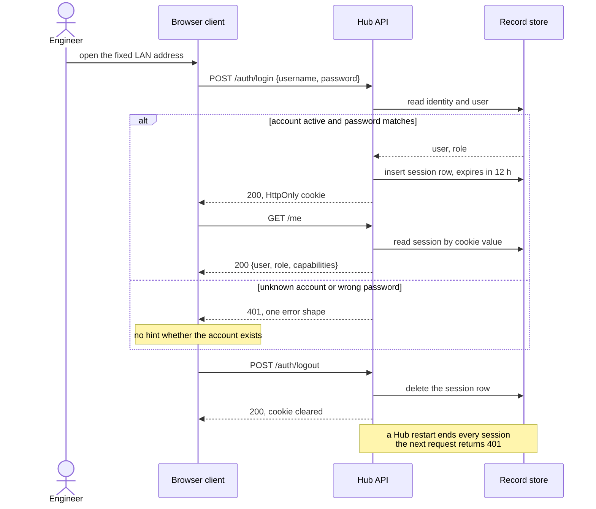
```mermaid
sequenceDiagram
  actor E as Engineer
  participant C as Browser client
  participant API as Hub API
  participant DB as Record store
  E->>C: open the fixed LAN address
  C->>API: POST /auth/login {username, password}
  API->>DB: read identity and user
  alt account active and password matches
    DB-->>API: user, role
    API->>DB: insert session row, expires in 12 h
    API-->>C: 200, HttpOnly cookie
    C->>API: GET /me
    API->>DB: read session by cookie value
    API-->>C: 200 {user, role, capabilities}
  else unknown account or wrong password
    API-->>C: 401, one error shape
    Note over C: no hint whether the account exists
  end
  C->>API: POST /auth/logout
  API->>DB: delete the session row
  API-->>C: 200, cookie cleared
  Note over API,DB: a Hub restart ends every session<br/>the next request returns 401
```

### S2 — Open the app the next morning

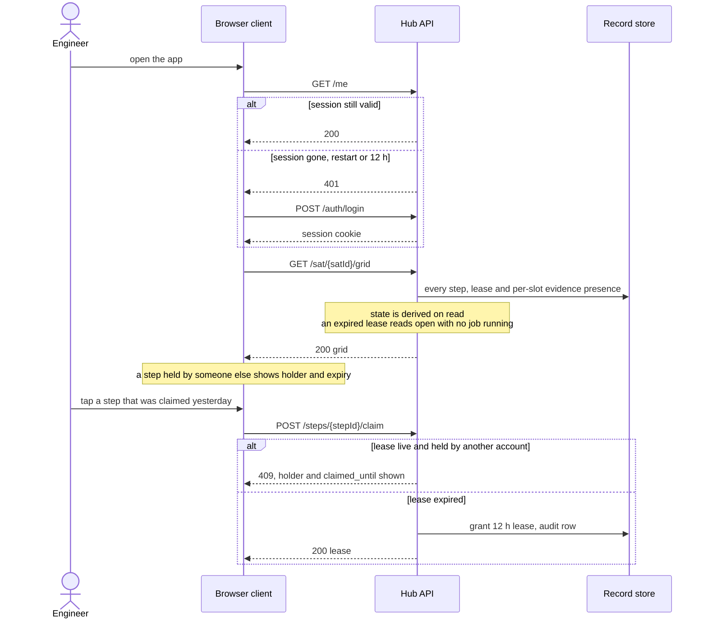
```mermaid
sequenceDiagram
  actor E as Engineer
  participant C as Browser client
  participant API as Hub API
  participant DB as Record store
  E->>C: open the app
  C->>API: GET /me
  alt session still valid
    API-->>C: 200
  else session gone, restart or 12 h
    API-->>C: 401
    C->>API: POST /auth/login
    API-->>C: session cookie
  end
  C->>API: GET /sat/{satId}/grid
  API->>DB: every step, lease and per-slot evidence presence
  Note over API: state is derived on read<br/>an expired lease reads open with no job running
  API-->>C: 200 grid
  Note over C: a step held by someone else shows holder and expiry
  E->>C: tap a step that was claimed yesterday
  C->>API: POST /steps/{stepId}/claim
  alt lease live and held by another account
    API-->>C: 409, holder and claimed_until shown
  else lease expired
    API->>DB: grant 12 h lease, audit row
    API-->>C: 200 lease
  end
```

### S3 — Read a form and review its flags

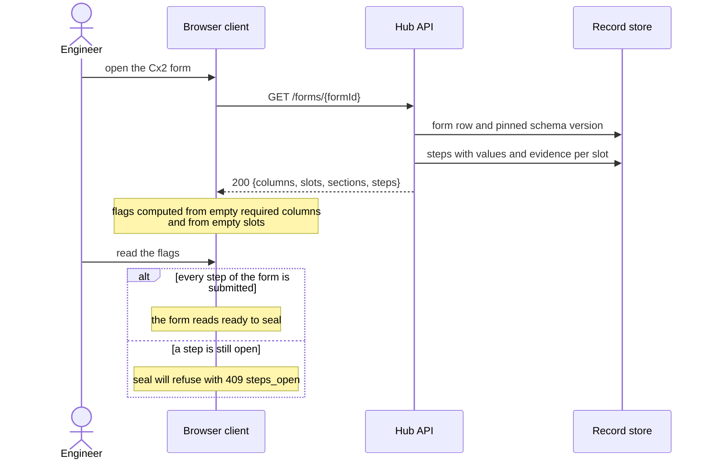
```mermaid
sequenceDiagram
  actor E as Engineer
  participant C as Browser client
  participant API as Hub API
  participant DB as Record store
  E->>C: open the Cx2 form
  C->>API: GET /forms/{formId}
  API->>DB: form row and pinned schema version
  API->>DB: steps with values and evidence per slot
  API-->>C: 200 {columns, slots, sections, steps}
  Note over C: flags computed from empty required columns<br/>and from empty slots
  E->>C: read the flags
  alt every step of the form is submitted
    Note over C: the form reads ready to seal
  else a step is still open
    Note over C: seal will refuse with 409 steps_open
  end
```

### S4 — Lease lifecycle: claim, race, renew, release

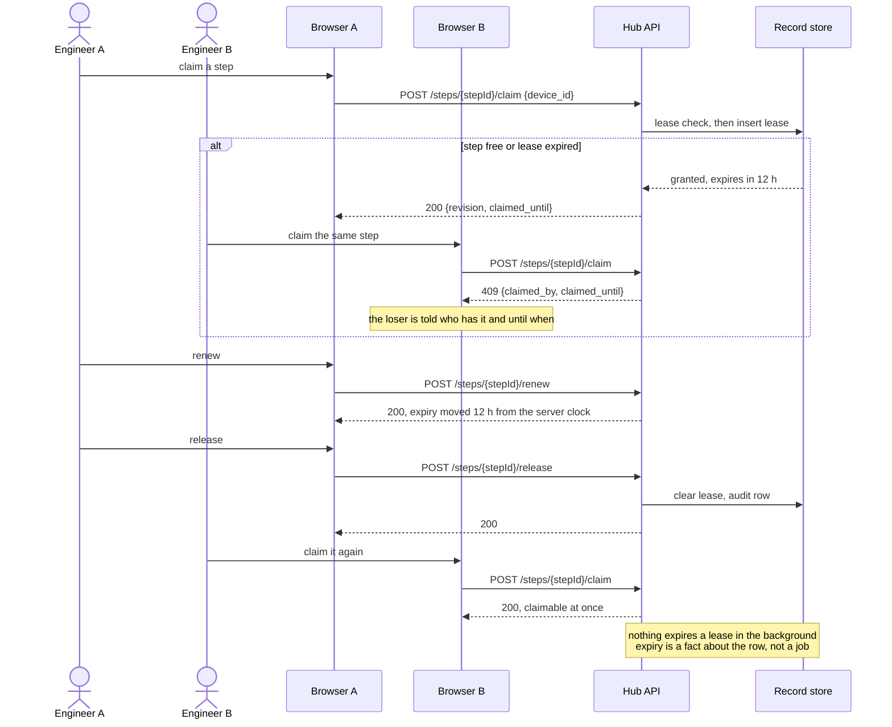
```mermaid
sequenceDiagram
  actor E1 as Engineer A
  actor E2 as Engineer B
  participant C1 as Browser A
  participant C2 as Browser B
  participant API as Hub API
  participant DB as Record store
  E1->>C1: claim a step
  C1->>API: POST /steps/{stepId}/claim {device_id}
  API->>DB: lease check, then insert lease
  alt step free or lease expired
    DB-->>API: granted, expires in 12 h
    API-->>C1: 200 {revision, claimed_until}
    E2->>C2: claim the same step
    C2->>API: POST /steps/{stepId}/claim
    API-->>C2: 409 {claimed_by, claimed_until}
    Note over C2: the loser is told who has it and until when
  end
  E1->>C1: renew
  C1->>API: POST /steps/{stepId}/renew
  API-->>C1: 200, expiry moved 12 h from the server clock
  E1->>C1: release
  C1->>API: POST /steps/{stepId}/release
  API->>DB: clear lease, audit row
  API-->>C1: 200
  E2->>C2: claim it again
  C2->>API: POST /steps/{stepId}/claim
  API-->>C2: 200, claimable at once
  Note over API,DB: nothing expires a lease in the background<br/>expiry is a fact about the row, not a job
```

### S5 — Capture to stored evidence

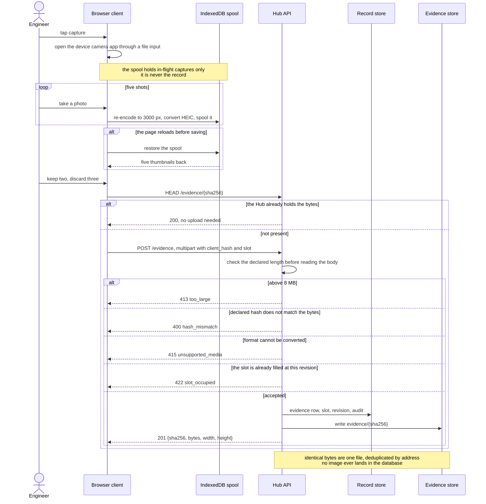
```mermaid
sequenceDiagram
  actor E as Engineer
  participant C as Browser client
  participant SP as IndexedDB spool
  participant API as Hub API
  participant DB as Record store
  participant EV as Evidence store
  E->>C: tap capture
  C->>C: open the device camera app through a file input
  Note over C,SP: the spool holds in-flight captures only<br/>it is never the record
  loop five shots
    E->>C: take a photo
    C->>SP: re-encode to 3000 px, convert HEIC, spool it
  end
  alt the page reloads before saving
    C->>SP: restore the spool
    SP-->>C: five thumbnails back
  end
  E->>C: keep two, discard three
  C->>API: HEAD /evidence/{sha256}
  alt the Hub already holds the bytes
    API-->>C: 200, no upload needed
  else not present
    C->>API: POST /evidence, multipart with client_hash and slot
    API->>API: check the declared length before reading the body
    alt above 8 MB
      API-->>C: 413 too_large
    else declared hash does not match the bytes
      API-->>C: 400 hash_mismatch
    else format cannot be converted
      API-->>C: 415 unsupported_media
    else the slot is already filled at this revision
      API-->>C: 422 slot_occupied
    else accepted
      API->>DB: evidence row, slot, revision, audit
      API->>EV: write evidence/{sha256}
      API-->>C: 201 {sha256, bytes, width, height}
    end
  end
  Note over API,EV: identical bytes are one file, deduplicated by address<br/>no image ever lands in the database
```

### S6 — Write a step and survive the refusals

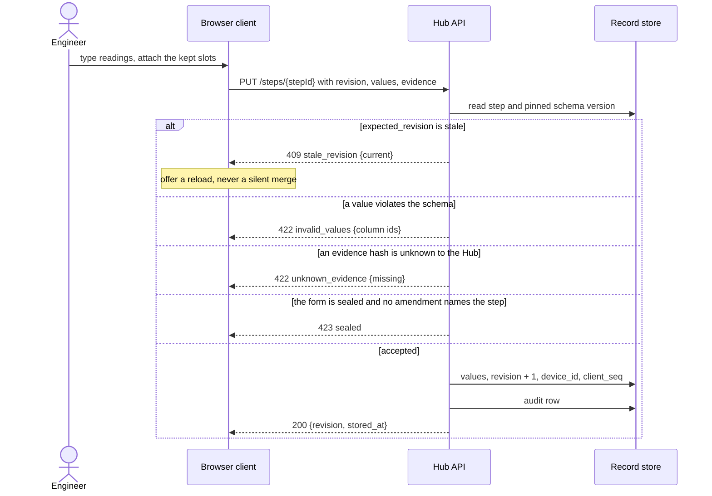
```mermaid
sequenceDiagram
  actor E as Engineer
  participant C as Browser client
  participant API as Hub API
  participant DB as Record store
  E->>C: type readings, attach the kept slots
  C->>API: PUT /steps/{stepId} with revision, values, evidence
  API->>DB: read step and pinned schema version
  alt expected_revision is stale
    API-->>C: 409 stale_revision {current}
    Note over C: offer a reload, never a silent merge
  else a value violates the schema
    API-->>C: 422 invalid_values {column ids}
  else an evidence hash is unknown to the Hub
    API-->>C: 422 unknown_evidence {missing}
  else the form is sealed and no amendment names the step
    API-->>C: 423 sealed
  else accepted
    API->>DB: values, revision + 1, device_id, client_seq
    API->>DB: audit row
    API-->>C: 200 {revision, stored_at}
  end
```

### S7 — Submit, flags, and form-level ready

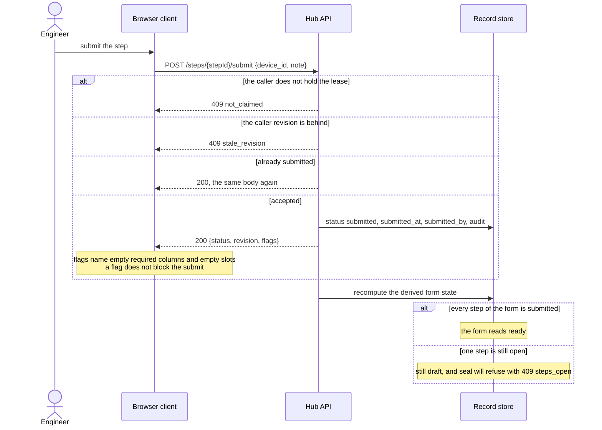
```mermaid
sequenceDiagram
  actor E as Engineer
  participant C as Browser client
  participant API as Hub API
  participant DB as Record store
  E->>C: submit the step
  C->>API: POST /steps/{stepId}/submit {device_id, note}
  alt the caller does not hold the lease
    API-->>C: 409 not_claimed
  else the caller revision is behind
    API-->>C: 409 stale_revision
  else already submitted
    API-->>C: 200, the same body again
  else accepted
    API->>DB: status submitted, submitted_at, submitted_by, audit
    API-->>C: 200 {status, revision, flags}
    Note over C: flags name empty required columns and empty slots<br/>a flag does not block the submit
  end
  API->>DB: recompute the derived form state
  alt every step of the form is submitted
    Note over DB: the form reads ready
  else one step is still open
    Note over DB: still draft, and seal will refuse with 409 steps_open
  end
```

### S8 — Seal one form

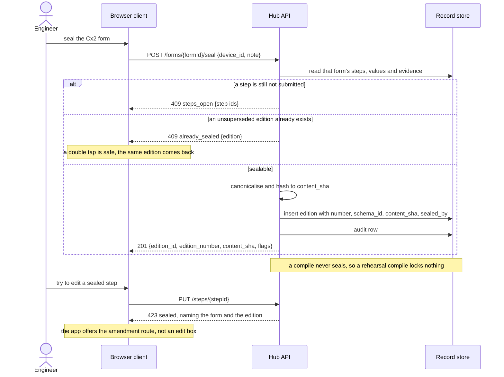
```mermaid
sequenceDiagram
  actor E as Engineer
  participant C as Browser client
  participant API as Hub API
  participant DB as Record store
  E->>C: seal the Cx2 form
  C->>API: POST /forms/{formId}/seal {device_id, note}
  API->>DB: read that form's steps, values and evidence
  alt a step is still not submitted
    API-->>C: 409 steps_open {step ids}
  else an unsuperseded edition already exists
    API-->>C: 409 already_sealed {edition}
    Note over C: a double tap is safe, the same edition comes back
  else sealable
    API->>API: canonicalise and hash to content_sha
    API->>DB: insert edition with number, schema_id, content_sha, sealed_by
    API->>DB: audit row
    API-->>C: 201 {edition_id, edition_number, content_sha, flags}
  end
  Note over API,DB: a compile never seals, so a rehearsal compile locks nothing
  E->>C: try to edit a sealed step
  C->>API: PUT /steps/{stepId}
  API-->>C: 423 sealed, naming the form and the edition
  Note over C: the app offers the amendment route, not an edit box
```

### S9 — Amend, correct, re-seal, supersede

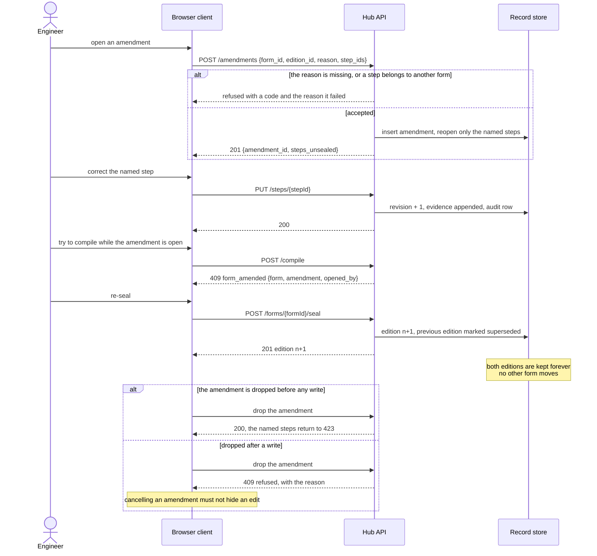
```mermaid
sequenceDiagram
  actor E as Engineer
  participant C as Browser client
  participant API as Hub API
  participant DB as Record store
  E->>C: open an amendment
  C->>API: POST /amendments {form_id, edition_id, reason, step_ids}
  alt the reason is missing, or a step belongs to another form
    API-->>C: refused with a code and the reason it failed
  else accepted
    API->>DB: insert amendment, reopen only the named steps
    API-->>C: 201 {amendment_id, steps_unsealed}
  end
  E->>C: correct the named step
  C->>API: PUT /steps/{stepId}
  API->>DB: revision + 1, evidence appended, audit row
  API-->>C: 200
  E->>C: try to compile while the amendment is open
  C->>API: POST /compile
  API-->>C: 409 form_amended {form, amendment, opened_by}
  E->>C: re-seal
  C->>API: POST /forms/{formId}/seal
  API->>DB: edition n+1, previous edition marked superseded
  API-->>C: 201 edition n+1
  Note over DB: both editions are kept forever<br/>no other form moves
  alt the amendment is dropped before any write
    C->>API: drop the amendment
    API-->>C: 200, the named steps return to 423
  else dropped after a write
    C->>API: drop the amendment
    API-->>C: 409 refused, with the reason
    Note over C: cancelling an amendment must not hide an edit
  end
```

### S10 — Screenshot: trigger out, image back, poll, expire

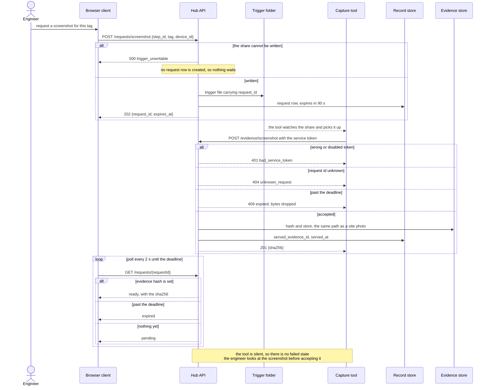
```mermaid
sequenceDiagram
  actor E as Engineer
  participant C as Browser client
  participant API as Hub API
  participant SH as Trigger folder
  participant TOOL as Capture tool
  participant DB as Record store
  participant EV as Evidence store
  E->>C: request a screenshot for this tag
  C->>API: POST /requests/screenshot {step_id, tag, device_id}
  alt the share cannot be written
    API-->>C: 500 trigger_unwritable
    Note over API: no request row is created, so nothing waits
  else written
    API->>SH: trigger file carrying request_id
    API->>DB: request row, expires in 90 s
    API-->>C: 202 {request_id, expires_at}
  end
  SH-->>TOOL: the tool watches the share and picks it up
  TOOL->>API: POST /evidence/screenshot with the service token
  alt wrong or disabled token
    API-->>TOOL: 401 bad_service_token
  else request id unknown
    API-->>TOOL: 404 unknown_request
  else past the deadline
    API-->>TOOL: 409 expired, bytes dropped
  else accepted
    API->>EV: hash and store, the same path as a site photo
    API->>DB: served_evidence_id, served_at
    API-->>TOOL: 201 {sha256}
  end
  loop poll every 2 s until the deadline
    C->>API: GET /requests/{requestId}
    alt evidence hash is set
      API-->>C: ready, with the sha256
    else past the deadline
      API-->>C: expired
    else nothing yet
      API-->>C: pending
    end
  end
  Note over TOOL,API: the tool is silent, so there is no failed state<br/>the engineer looks at the screenshot before accepting it
```

### S11 — Compile, manifest, download

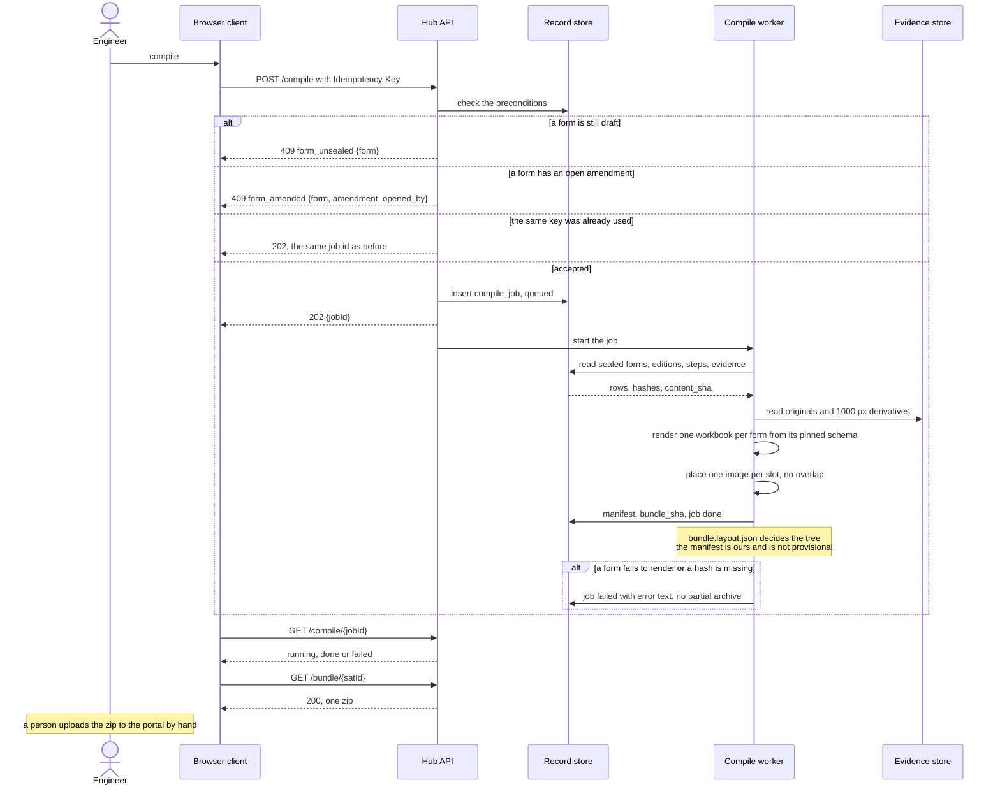
```mermaid
sequenceDiagram
  actor E as Engineer
  participant C as Browser client
  participant API as Hub API
  participant DB as Record store
  participant CW as Compile worker
  participant EV as Evidence store
  E->>C: compile
  C->>API: POST /compile with Idempotency-Key
  API->>DB: check the preconditions
  alt a form is still draft
    API-->>C: 409 form_unsealed {form}
  else a form has an open amendment
    API-->>C: 409 form_amended {form, amendment, opened_by}
  else the same key was already used
    API-->>C: 202, the same job id as before
  else accepted
    API->>DB: insert compile_job, queued
    API-->>C: 202 {jobId}
    API->>CW: start the job
    CW->>DB: read sealed forms, editions, steps, evidence
    DB-->>CW: rows, hashes, content_sha
    CW->>EV: read originals and 1000 px derivatives
    CW->>CW: render one workbook per form from its pinned schema
    CW->>CW: place one image per slot, no overlap
    CW->>DB: manifest, bundle_sha, job done
    Note over CW: bundle.layout.json decides the tree<br/>the manifest is ours and is not provisional
    alt a form fails to render or a hash is missing
      CW->>DB: job failed with error text, no partial archive
    end
  end
  C->>API: GET /compile/{jobId}
  API-->>C: running, done or failed
  C->>API: GET /bundle/{satId}
  API-->>C: 200, one zip
  Note over E: a person uploads the zip to the portal by hand
```

Bundle file naming is fixed: the store keeps files under their full hash (`evidence/<sha256>`), while the bundle names each file `<step_no>-<slot_id>-<first 8 hex of sha256>.<ext>` with the extension from the stored file. When both an original and a derivative exist, both are included; the manifest marks the original authoritative and the derivative as the document copy the workbook embeds. Every manifest entry carries the full sha256, step, slot and revision, so a bundle file always resolves to one stored hash.

### S12 — Daily summary, backup, restore

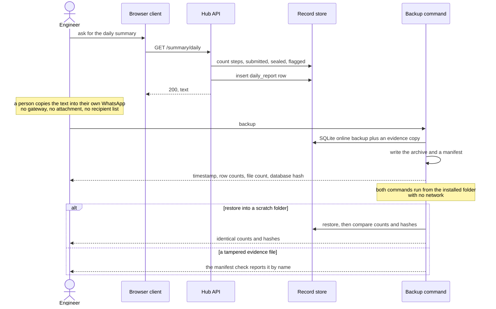
```mermaid
sequenceDiagram
  actor E as Engineer
  participant C as Browser client
  participant API as Hub API
  participant DB as Record store
  participant CLI as Backup command
  E->>C: ask for the daily summary
  C->>API: GET /summary/daily
  API->>DB: count steps, submitted, sealed, flagged
  API->>DB: insert daily_report row
  API-->>C: 200, text
  Note over E: a person copies the text into their own WhatsApp<br/>no gateway, no attachment, no recipient list
  E->>CLI: backup
  CLI->>DB: SQLite online backup plus an evidence copy
  CLI->>CLI: write the archive and a manifest
  CLI-->>E: timestamp, row counts, file count, database hash
  Note over CLI: both commands run from the installed folder<br/>with no network
  alt restore into a scratch folder
    CLI->>DB: restore, then compare counts and hashes
    CLI-->>E: identical counts and hashes
  else a tampered evidence file
    CLI-->>E: the manifest check reports it by name
  end
```

### S13 — Install, accounts and the tool token

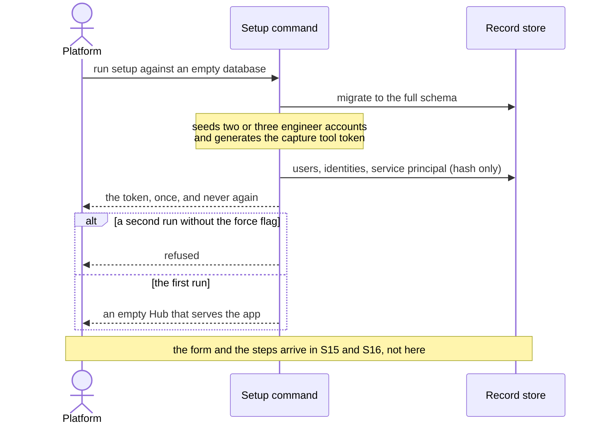
```mermaid
sequenceDiagram
  actor P as Platform
  participant CLI as Setup command
  participant DB as Record store
  P->>CLI: run setup against an empty database
  CLI->>DB: migrate to the full schema
  Note over CLI: seeds two or three engineer accounts<br/>and generates the capture tool token
  CLI->>DB: users, identities, service principal (hash only)
  CLI-->>P: the token, once, and never again
  alt a second run without the force flag
    CLI-->>P: refused
  else the first run
    CLI-->>P: an empty Hub that serves the app
  end
  Note over P,DB: the form and the steps arrive in S15 and S16, not here
```

### S14 — Site day

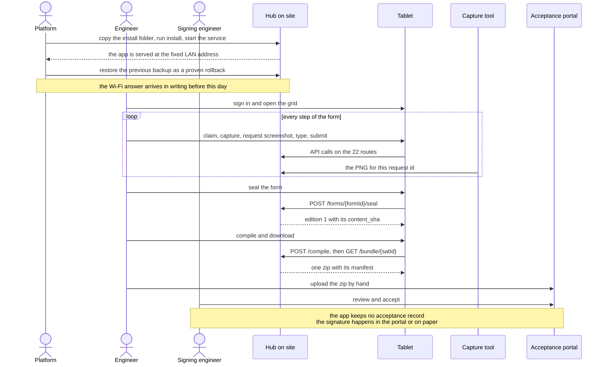
```mermaid
sequenceDiagram
  actor P as Platform
  actor E as Engineer
  actor S as Signing engineer
  participant HUB as Hub on site
  participant T as Tablet
  participant TOOL as Capture tool
  participant ACC as Acceptance portal
  P->>HUB: copy the install folder, run install, start the service
  HUB-->>P: the app is served at the fixed LAN address
  P->>HUB: restore the previous backup as a proven rollback
  Note over P,HUB: the Wi-Fi answer arrives in writing before this day
  E->>T: sign in and open the grid
  loop every step of the form
    E->>T: claim, capture, request screenshot, type, submit
    T->>HUB: API calls on the 22 routes
    TOOL->>HUB: the PNG for this request id
  end
  E->>T: seal the form
  T->>HUB: POST /forms/{formId}/seal
  HUB-->>T: edition 1 with its content_sha
  E->>T: compile and download
  T->>HUB: POST /compile, then GET /bundle/{satId}
  HUB-->>T: one zip with its manifest
  E->>ACC: upload the zip by hand
  S->>ACC: review and accept
  Note over S,ACC: the app keeps no acceptance record<br/>the signature happens in the portal or on paper
```

### S15 — Define our standard SAT format

Before any site work the SAT format is agreed once as a single versioned master record: columns, types, slots, sections, layout. The version is immutable once a form pins it; after the first seal a change means a new form.

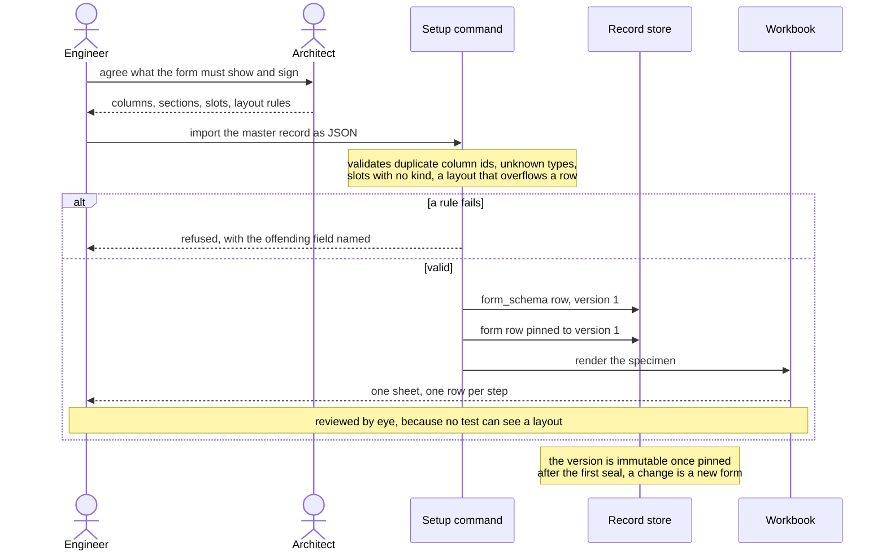
```mermaid
sequenceDiagram
  actor E as Engineer
  actor A as Architect
  participant CLI as Setup command
  participant DB as Record store
  participant WB as Workbook
  E->>A: agree what the form must show and sign
  A-->>E: columns, sections, slots, layout rules
  E->>CLI: import the master record as JSON
  Note over CLI: validates duplicate column ids, unknown types,<br/>slots with no kind, a layout that overflows a row
  alt a rule fails
    CLI-->>E: refused, with the offending field named
  else valid
    CLI->>DB: form_schema row, version 1
    CLI->>DB: form row pinned to version 1
    CLI->>WB: render the specimen
    WB-->>E: one sheet, one row per step
    Note over E,WB: reviewed by eye, because no test can see a layout
  end
  Note over DB: the version is immutable once pinned<br/>after the first seal, a change is a new form
```

### S16 — Instrument list to step list

The project's instrument or IO list supplies tags, levels and step numbers. The form is generated from the standard format plus those steps.

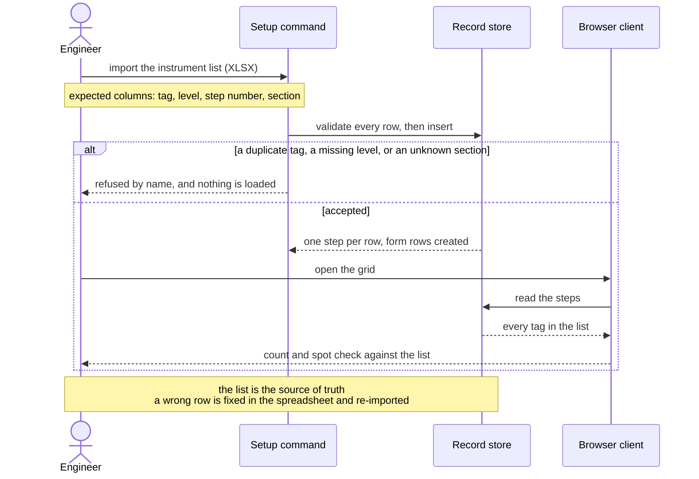
```mermaid
sequenceDiagram
  actor E as Engineer
  participant CLI as Setup command
  participant DB as Record store
  participant C as Browser client
  E->>CLI: import the instrument list (XLSX)
  Note over E,CLI: expected columns: tag, level, step number, section
  CLI->>DB: validate every row, then insert
  alt a duplicate tag, a missing level, or an unknown section
    CLI-->>E: refused by name, and nothing is loaded
  else accepted
    DB-->>CLI: one step per row, form rows created
    E->>C: open the grid
    C->>DB: read the steps
    DB-->>C: every tag in the list
    C-->>E: count and spot check against the list
  end
  Note over E,DB: the list is the source of truth<br/>a wrong row is fixed in the spreadsheet and re-imported
```

### S17 — Scanned list to candidate, then a person commits

Conditional, and gated: it is built only if a scanned or PDF list arrives, and trusted only after a labelled-sample score exists that someone other than its author agreed to. It proposes; a person commits through the same import as S16. It never writes to the record.

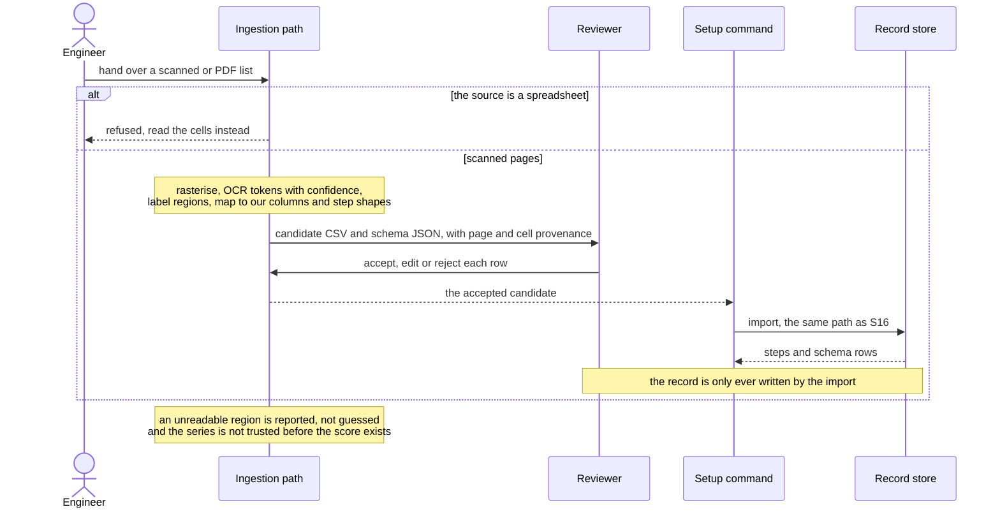
```mermaid
sequenceDiagram
  actor E as Engineer
  participant ING as Ingestion path
  participant R as Reviewer
  participant CLI as Setup command
  participant DB as Record store
  E->>ING: hand over a scanned or PDF list
  alt the source is a spreadsheet
    ING-->>E: refused, read the cells instead
  else scanned pages
    Note over ING: rasterise, OCR tokens with confidence,<br/>label regions, map to our columns and step shapes
    ING->>R: candidate CSV and schema JSON, with page and cell provenance
    R->>ING: accept, edit or reject each row
    ING-->>CLI: the accepted candidate
    CLI->>DB: import, the same path as S16
    DB-->>CLI: steps and schema rows
    Note over R,DB: the record is only ever written by the import
  end
  Note over ING: an unreadable region is reported, not guessed<br/>and the series is not trusted before the score exists
```

### Route coverage

Every route in the interface spec appears in at least one diagram. This table is the check a reviewer can run.

| Route | Diagrams | Route | Diagrams |
|---|---|---|---|
| `POST /auth/login` | S1, S2 | `PUT /steps/{stepId}` | S6, S8, S9 |
| `POST /auth/logout` | S1 | `POST /forms/{formId}/seal` | S8, S9, S14 |
| `GET /me` | S1, S2 | `POST /amendments` | S9 |
| `GET /sat/{satId}/grid` | S2, S3 | `POST /requests/screenshot` | S10, S14 |
| `GET /forms/{formId}` | S3 | `GET /requests/{requestId}` | S10 |
| `POST /steps/{stepId}/claim` | S2, S4 | `POST /evidence/screenshot` | S10, S14 |
| `POST /steps/{stepId}/renew` | S4 | `POST /compile` | S9, S11, S14 |
| `POST /steps/{stepId}/release` | S4 | `GET /compile/{jobId}` | S11 |
| `POST /steps/{stepId}/submit` | S7, S14 | `GET /bundle/{satId}` | S11, S14 |
| `POST /evidence` | S5 | `GET /summary/daily` | S12 |
| `HEAD /evidence/{sha256}` | S5 | commands and human acts | S12, S13, S14, S15, S16, S17 |
| `GET /evidence/{sha256}` | S5, S10 | | |

`GET /evidence/{sha256}` is the read half an engineer uses to look at a stored image before accepting a step; it is shown inside S10 where the screenshot arrives, and it takes the same route in S5.

## States

Step state is derived from the lease and the submit act. It is never written by a client.

| State | Entered when | Exits to | Visible to |
|---|---|---|---|
| open | no lease, or the lease expired | claimed | all engineers |
| claimed | a claim was granted and the lease is live | in progress, open on release or expiry | all engineers, with the holder named |
| in progress | at least one accepted write on the step | submitted, open on release or expiry | all engineers, with the holder named |
| submitted | the engineer submitted the step | open only through an amendment after the form is sealed | all engineers; locked after seal |

Form state is derived too. There is no step-level "complete": that is a statement about the form.

| State | Entered when | Exits to | Visible to |
|---|---|---|---|
| draft | no unsuperseded edition for the form | ready, sealed | all engineers |
| ready | no edition, and every step of the form is submitted | sealed | all engineers |
| sealed | one unsuperseded edition exists and no open amendment names a step of it | amended | all engineers; writes refused with 423 |
| amended | an open amendment row names a step of it | sealed on re-seal | all engineers; compile refused |
| superseded | the form has a later edition | never — kept forever | all engineers; read-only history |

Screenshot request state is derived from one row and the server clock: `pending`, `ready` when the evidence hash is set, `expired` past the deadline. There is no `failed`. Compile job state is the one stored machine state: `queued`, `running`, `done`, `failed`.

## Permissions

| Action | anonymous | engineer (signed in) | service principal | signer (outside the app) |
|---|---|---|---|---|
| read the app and sign in | yes | yes | no | yes, if they have an account |
| read grid and form | no | yes | no | no |
| claim, renew, release, submit | no | only while holding the lease, or to take a free step | no | no |
| write a step | no | only while holding the lease and only while the form is draft or amended | no | no |
| upload evidence to a slot | no | yes, bound to a step they hold | no | no |
| request a screenshot | no | yes | no | no |
| post a screenshot | no | no | yes, with a valid token, for an unexpired request | no |
| seal a form | no | yes | no | no |
| open or drop an amendment | no | yes, with a reason | no | no |
| compile and download | no | yes | no | no |
| generate the daily summary | no | yes | no | no |
| accept the SAT | no | no | no | yes, in ACC or on paper |

One role in v1. The `role` column exists so v2 adds data, not schema. There is no per-step ownership beyond the lease: any engineer may claim any free step.

## Rules and limits

| Rule | Value | Source |
|---|---|---|
| lease length | 12 hours from the server clock | R7, decision D8 |
| screenshot expiry | 90 seconds; client polls every 2 seconds | R30 |
| session length | 12 hours sliding; a restart ends all sessions | R3 |
| image long edge | 3000 px, re-encoded in the client | R60 |
| upload cap | 8 MB after encode; 413 above it | R60 |
| pre-decode reject | above 20 MB, before decode | R60 |
| tool PNG cap | 10 MB | R60 |
| document copy | 1000 px derivative, derived by the Hub | R28 |
| images per slot | one per revision; a second needs a new revision and replaces the spool | R27 |
| evidence retention | append-only; no file overwritten or deleted | R61, D11 |
| step values | JSON keyed by schema column id of the pinned version | interface spec, Step record |
| seals per form | one per edition; editions are whole-form and never partial | R21 |
| compile preconditions | every form sealed, no open amendment, one run | R23 |
| numeric literals in routes | none above 60; all in the config module | R46 |

## Failure and empty states

- **Empty, first run.** A newly seeded SAT shows a grid of steps all open, no evidence and no editions. The form reads draft. Nothing is red; nothing is flagged until a person submits or seals.
- **Empty, no site form authored.** The setup import refuses a fixture whose rows do not match the schema and names the offending row. It does not create a half-loaded step list.
- **Partial, one engineer's device dies mid-test.** Their unsent spool is lost with the device. Steps they already wrote are on the Hub, and steps they held stay claimed until the lease expires, then read open to everyone else. This is stated in the checklist rather than hidden.
- **Partial, capture share unreachable.** The screenshot request fails before a row is created, so the client shows a refusal rather than a spinner. Site photos and every other field keep working.
- **Partial, ACC tree wrong.** A compile still succeeds, the bundle is complete, and the fix is one config file plus a re-run. Nothing in the record changes.
- **Slow, grid past 200 ms.** The client shows the last grid with a stale marker and a manual refresh. There is no background polling of the grid.
- **Slow, compile.** The job reports progress by state, not by percentage. The engineer may close the tab; the job continues and the download is by job id.
- **Broken, Hub restart during a test.** Everyone is signed out and every lease survives in the record but is not renewed. The checklist says: sign in again, re-claim what you were holding, and check the grid before retyping.
- **Refused, sealed step.** 423 names the form and edition, and the UI offers the amendment route rather than an edit box.

## Screens

`[N/A — no screen designs exist]`. There are two client surfaces, the grid and the step screen, and they are specified by their controls and states in F2, F3 and R35 rather than by a picture. Inventing a layout here would be a design decision taken by the wrong person; the receiving client developer owns it (`06`, D6).
